# 서비스 소개

## 1. 서비스 설명


**개요**

- 한줄소개 : 마피아를 제대로 즐기고 싶은 현대인 들을 위한 웹 화상 마피아 게임 서비스
- 서비스명 : **모두의 마피아**


**타켓**🎯

- 온라인으로 마피아를 즐기고 싶은 사람들
- 온라인으로 술 게임을 하고 싶은 학생들


👉 **팀 빌딩이 필요한 모든 사람들**


## 2. 기획 배경

### 배경

온라인으로 마피아 게임을 하고 싶을 때가 있습니다. 하지만 온라인 게임 중에서는 화상, 채팅, 제대로 된 게임 시스템을 갖춘 게임이 없었습니다. 그래서 저희는 화상, 채팅, 마피아 게임 시스템을 모두 갖춘  게임을 만드는데 집중했습니다.


### 목적🥅

화상, 채팅, 랭킹, 랜덤매칭, 악성유저 제제, 게더타운, 마피아 게임 시스템을 모두 갖춘 게임을 만들자


### 의의

- 비대면 상황에서 직접 만나지 않고도 즐길 수 잇는 온라인 웹 화상 마피아 게임
- 게더타운, 랜덤매칭, 레드유저 등 게임을 즐길 수 있게 해주는 게임 시스템


## 3. 서비스 화면

**메인페이지 시연 순서**

 메인페이지 => 회원가입 => 로그인(자체로그인, KakaoOauth) => 공지사항 => 랭킹페이지 => 마이페이지 => 유저관리 순으로 가겠습니다.

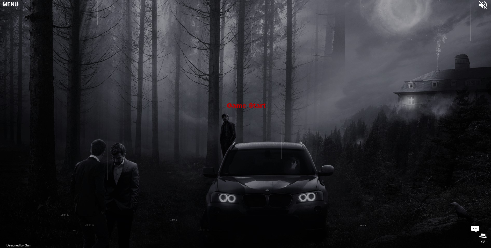

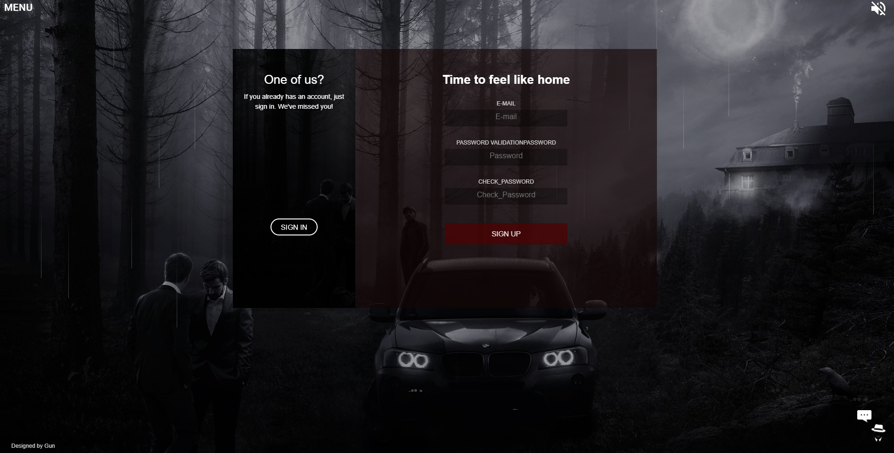

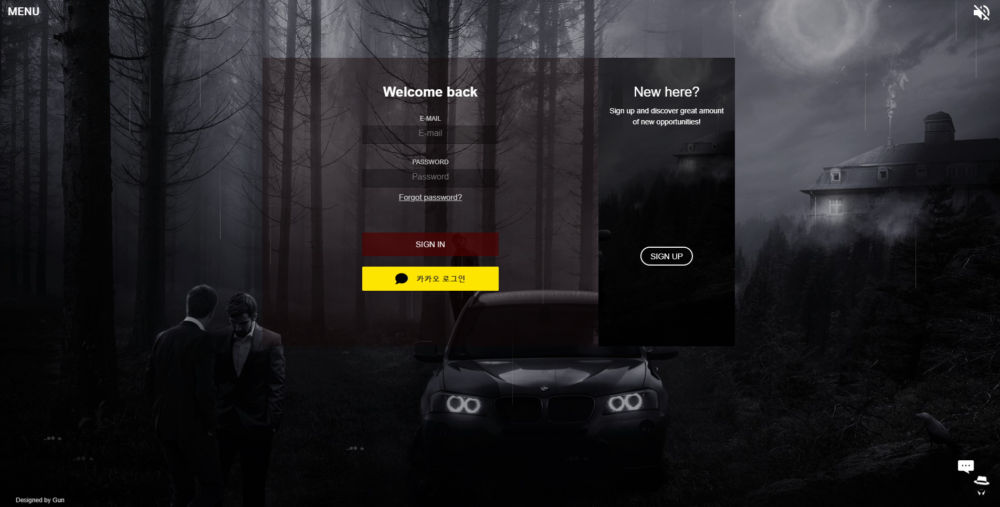

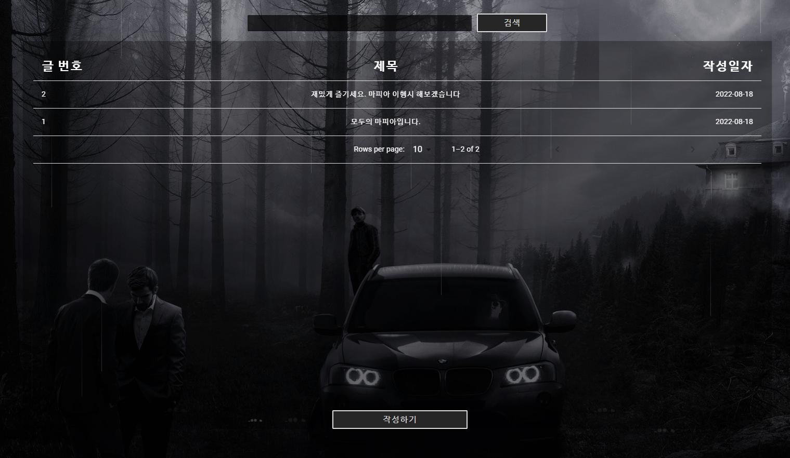

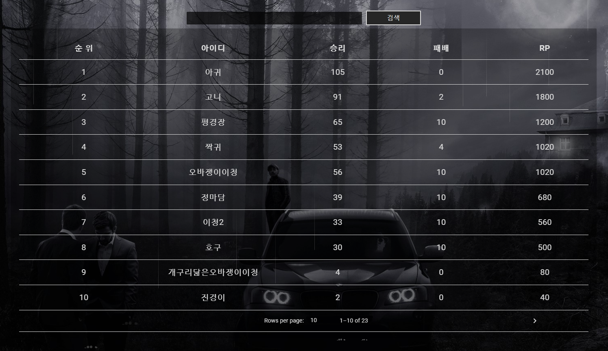

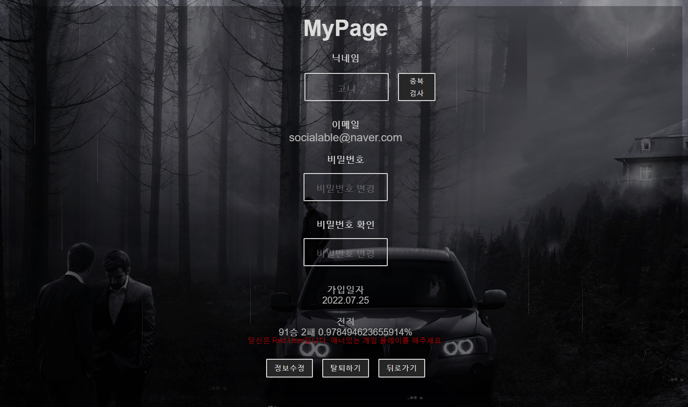

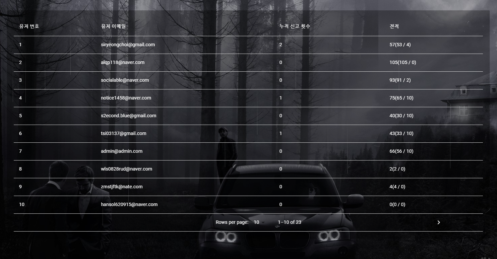


게임 시연 순서 대기실 => 대기방 => 게임방

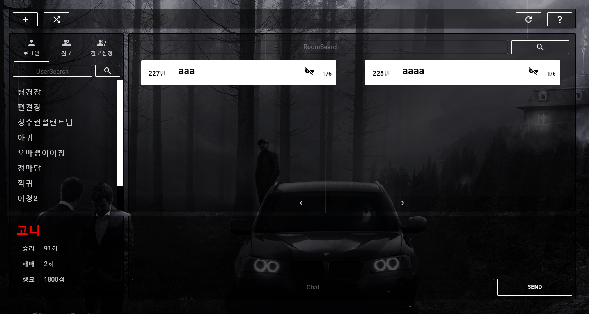

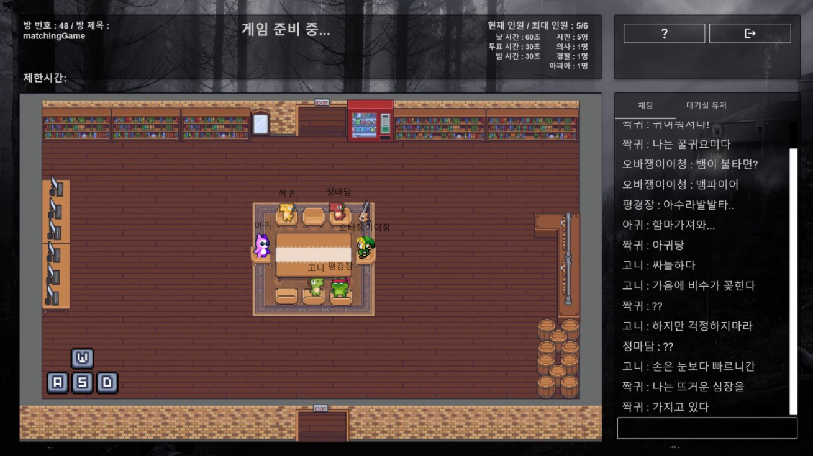

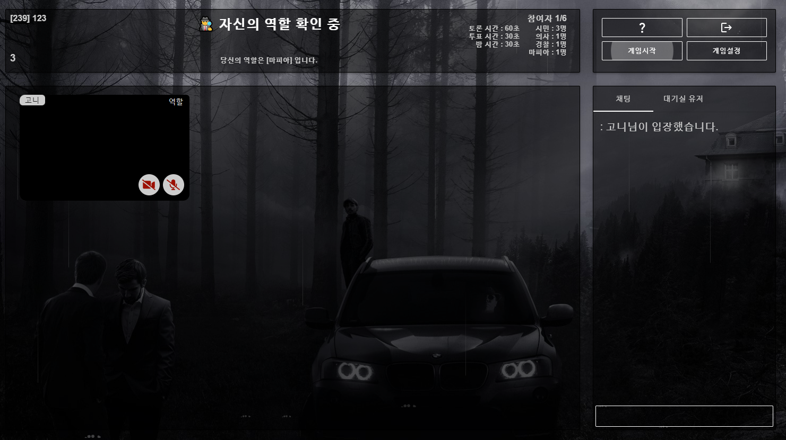


# 기술스텍

## 2. WebRTC

### WebRTC란?

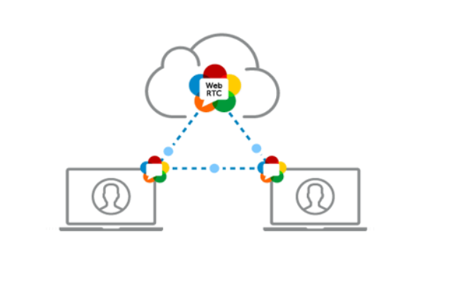

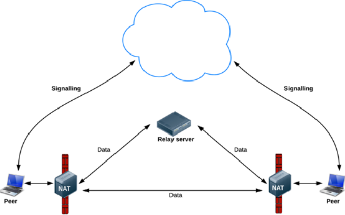


WebRTC (Web Real-Time Communication)는 웹 브라우저 간에 플러그인의 도움 없이 서로 통신할 수 있도록 설계된 API이다!!

W3C에서 제시된 초안이며, 음성 통화, 영상 통화, P2P 파일 공유 등으로 활용될 수 있다!!


## openVidu란?

- 웹 또는 모바일 애플리케이션에서 화상 통화를 쉽게 추가할 수 있는 플랫폼
- Kurento기반의 중개 서버를 애플리케이션에 쉽게 추가할 수 있도록 완전한 기술스택을 제공
  **Kurento** : WebRTC 미디어 서버 역할을 함과 동시에 WebRTC 기술을 이용해 애플리케이션 개발을 돕는 클라이언트 API세트

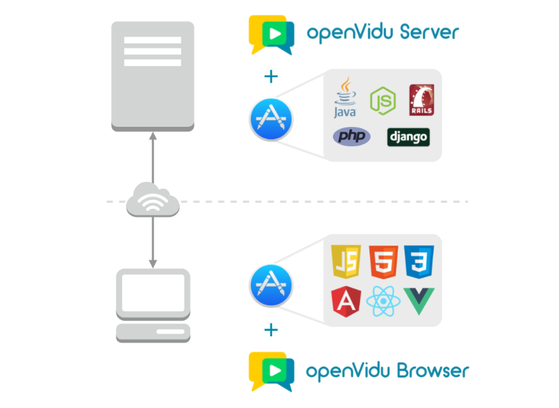

### 적용

모두의 마피아에서는 화상 통화를 가능케 하기 위해서 openvidu를 사용합니다. 마피아 게임방 컴포넌트에서 openvidu를 사용하여 사용자간의 비디오 스트림을 지원하여 실시간 영상 통화가 가능합니다.


## 2. Web Socket

### web socket 이란?


일반적인 `Ajax` 통신과 다르게, 특정 `end point`를 구독하면 종단지점과 연결된 모든 통신을 수신할 수 있으며, 실시간 소통이 가능합니다. 그래서 실시간 채팅등에 많이 활용되고 있습니다. 아래 이미지를 통해 통신 방법을 간단히 이해할 수 있습니다.


**Sockjs**


소켓 통신을 가능케하기 위한 첫 번째 라이브러입니다. SockJs로 통신에 필요한 end point로 socket 객체를 생성합니다.


**Stomp.js**


소켓 통신을 가능케하기 위한 두 번째 라이브러리 입니다. Stomp.js로 생성된 socket 객체로 부터 stompClient를 생성하고 연결 및 구독, 전송합니다. 프론트에서 소켓을 토해 전송된 내용은 백엔드에서 동일한 endpoint로 일괄적으로 수신되며, 백엔드에서 이를 다시 프론트로 전달합니다. 채팅 소켓에 경우 추가적인 처리 없이 받은 내용을 그대로 모든 구독자에게 반환하고, 매칭, 투표 기능들에서는 백엔드에서 로직을 통햇 header값과 data값을 바꿔 front로 반환합니다.


## 3. API

### [Oauth(Kakao)](https://developers.kakao.com/)

OAuth는 인터넷 사용자들이 비밀번호를 제공하지 않고 다른 웹사이트 상의 자신들의 정보에 대해 웹사이트나 애플리케이션의 접근 권한을 부여할 수 있는 공통적인 수단으로서 사용되는, **접근 위임을 위한 개방형 표준**이다.


### [채널톡](https://channel.io/ko?utm_source=google&utm_medium=cpc&utm_campaign=brand&utm_content=%EC%B1%84%ED%8C%85%EC%83%81%EB%8B%B4%EC%B1%84%EB%84%90%ED%86%A1&utm_term=&gclid=Cj0KCQjwxveXBhDDARIsAI0Q0x1s0ikKlyUqg1Pxco-NrETLi7SwPTwigp6aWP5-NUqzT1Q4Yx1boVUaArcKEALw_wcB)

채팅상담/챗봇/고객관리 한번에 처리할 수 있는 API 서비스이다.


# 게임 컨텐츠 소개

### 1. 마피아


마피아, 시민, 경찰, 의사 네가지 역할로 진행되는 심리 롤플레잉 게임


### Rule

```
역할
1. 역할은 마피아, 시민, 경찰, 의사 네가지
2. 마피아 : 마피아라는 것을 들키지 않고, 시민, 경찰, 의사 제거
3. 시민 : 마피아로 의심되는 사람을 추리하여, 모든 마피아를 소탕
4. 경찰 : 밤에 플레어들의 역할을 파악하여, 마피아로 의심되는 사람을 추리하여 모든 마피아 소탕
5. 경찰 : 밤에 마피아가 죽일것 같은 사람을 살려, 마피아로 의심되는 사람을 추리하여 모든 마피아 소탕
```

```
승리 조건
마피아 승리 : 마피아 수와 시민의 수가 같아지면 마피아가 승리합니다.
시민, 경찰, 의사 승리 : 모든 마이파를 검거하면 시민이 승리합니다.
```


### 게임 Rule

```
1. 낮 자유토론 : 자유롭게 토론을 하는 시간입니다. 이 시간동안 시민들은 누가 마피아인지 추측합니다.
2. 낮 투표 : 마피아로 의심되는 사람 1명을 투표합니다.
3. 최후 변론 : 마피아로 지목당한 사람의 최후 변론을 듣습니다.
4. 밤 : 모두 잠든 시간 마피아는 조용히 시민 한 명을 제거하고, 경찰은 플레이어 한명의 역할 파악, 의사는 마피아가 죽일 것 같은 사람 살리기
```


# 4. 프로젝트 진행

온라인, 오프라인을 병행해서 진행되었기에 진행 방식과 소통 방법이 중요했습니다.

그래서 우리는 Agile 방법으로 프로젝트를 진행했고 Jira의 Scrum 방식을 채틱하여  커뮤니케이션 리소스를 줄였습니다.

## 1. Git Flow

Git Flow는 최종 배포를 위한 Master, 배포 및 테스트를 위한 develop, 프론트와 백앤드를 나눠주는 front, backend 브랜치, 그리고 세부 기능을 개발할 수 잇는 Feature/(기능명) 브랜치로 구성하여 GitFloew를 구성했습니다.

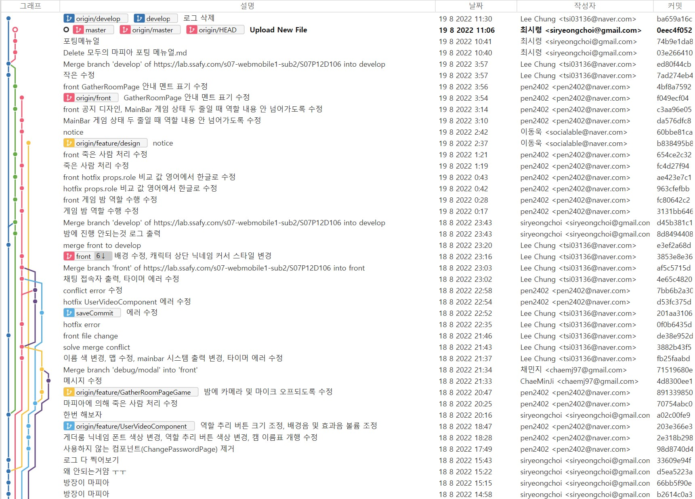

## 2. Gantte Chart

첫 주에 기획을 하면서 각자 역할 분담 및 일정 계획을 세웠습니다.

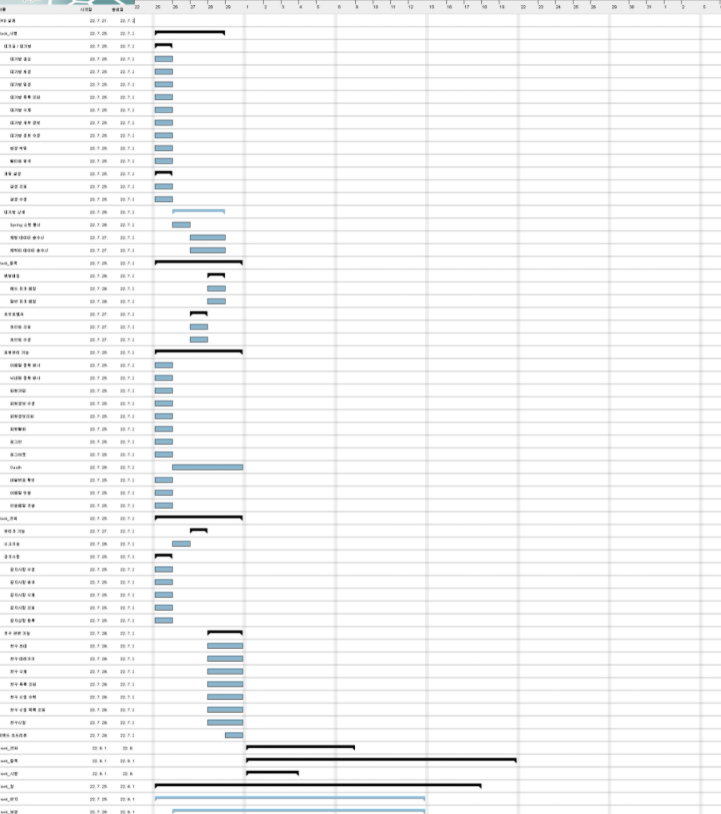


## 3. Jira

첫주에 위의 Gantte Chart 작성한 것에 바탕으로 Scrum으로 이슈를 백로그에 등록했습니다. 금주에 완료하지 못한 이슈는 앞으로 진행할 이슈에 추가했습니다.

- 에픽은 가장 큰 단위인 기획, 유저관리, 서버, 게더타운 등으로 구성하였습니다.
- 스토리는 로그인 페이지 구성한다와같이 작성하였으며 그 밑에 sub task를 두어 세부할일을 적었습니다.

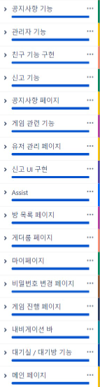

### 4. Notion

데일리 스크럼 , API문서, 발표정리 등 문서들에 대한 저료는 Notion을 통해서 작성했습니다.

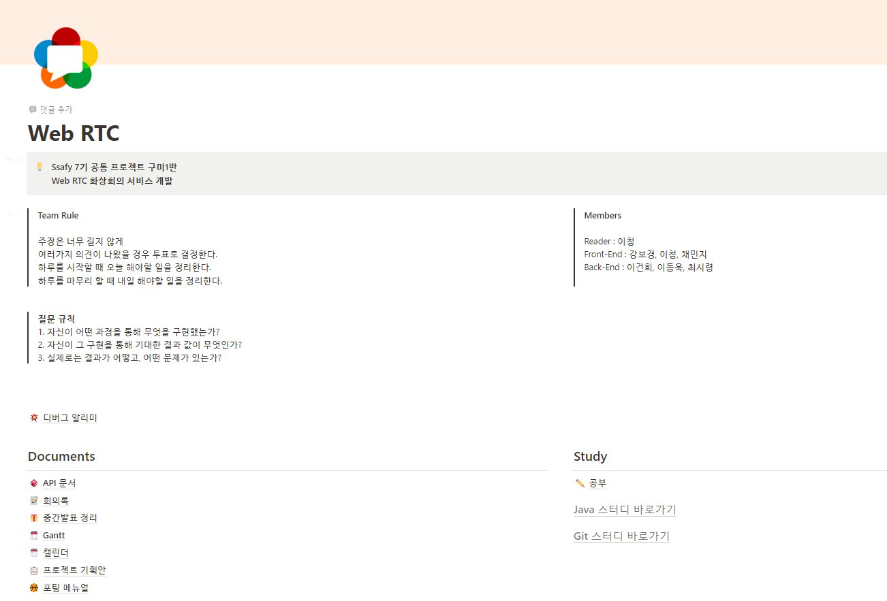

### 5. Figma

1주차 계획 때 UI/UX 및 wireFrame을 figma로 만들었다.

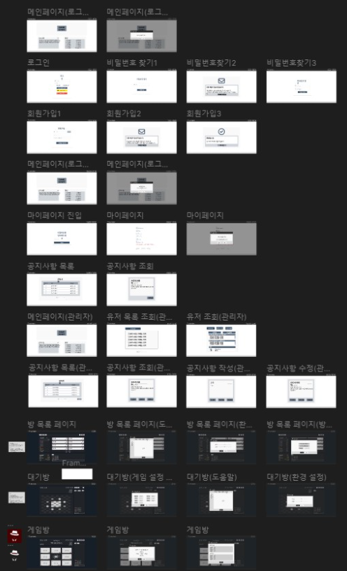


# 5. 배포

포팅메뉴얼에 포함되어있습니다. 참고하세요!


# 6. 소감 및 배운점

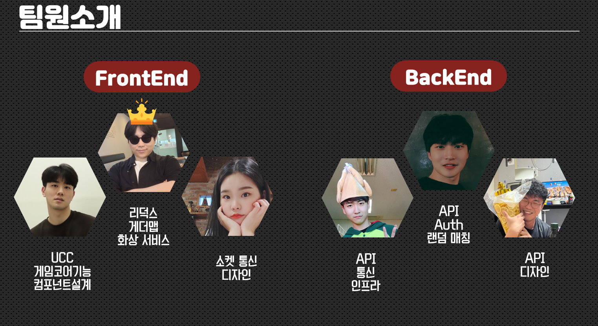

- 이청 : 첫 6인 프로젝트이자 가장 큰 프로젝트 규모였던 만큼 협업과 프로젝트 설계 측면에서 많은 것을 배울 수 있었습니다. 더욱이 팀장 역을 맡았던 만큼 프로젝트 진행과 인력 분배, 의견 조율 등에 대한 안목과 경험을 쌓을 수 있었습니다.

- 강보경  : 리액트, WebRTC 모두 처음 접해보는 기술들이었지만 6주의 프로젝트를 통해 코드를 작성해나가며 여러 기술을 이해하고 많이 배울 수 있었습니다. 처음 기획 단계에서는 이렇게 많은 걸 다 소화해낼 수 있을까 생각했지만 팀원들이 다들 열심히 참여하여 결국 완성할 수 있었습니다. 여러 협업 툴에 대해서도 배울 수 있어 유익한 시간들이었습니다. 모두 감사합니다!
- 이건희 : 처음 사용하는 언어와 라이브러리들에 시작하기전에는 겁을 먹었지만 좋은 팀원들에게 배우고 함께 프로젝트를 진행하며 많은 성장을 이룰 수 있었습니다. 덕분에 만족스러운 결과물과 좋은 추억을 가져갈 수 있었습니다.

- 이동욱 : 재밌는 프로젝트를 마음 잘 맞는 팀원과 할 수 있어 행복했습니다. 6주의 시간이 엄청 빨리 지나갔서 아쉽습니다.. 시간 더 있으면 함께 더 잘 할 수 있을 것같다는 생각이 많이 들었습니다. 정말 팀원들 덕분에 끝까지 할 수 있었고 많은 것을 배울 수 있습니다. 우리 6캔두잇조 취뽀해서 서울에서 보자~~~
- 채민지 :  좋은 사람들과 함께 해서 6주 프로젝트동안 많이 성장한 것 같습니다. 6명 협력 프로젝트를 처음해봐서 힘들까 걱정했지만 팀원들이 적극적으로 참여한 덕분에 편하게 진행했습니다. React를 사용해본적이 없어 걱정이 많았는데 팀원들의 도움을 받아 어려움 없이 잘 끝내서 매우 뿌듯합니다.
- 최시령 : 처음부터 끝까지 쉬운게 하나도 없었습니다. 팀원들이 다들 열정적이고, 욕심들이 많아서 어려웠음에도 불구하고 밤을 새워가면서 결과물을 만들어낼 수 있어서 참 좋았습니다. 이번 프로젝트에서는 백엔드 뿐만 아니라 인프라 쪽을 담당을 했는데 생각보다 흥미로운 주제인 것 같아 공부를 조금 더 해보고 싶다는 생각이 들었습니다.