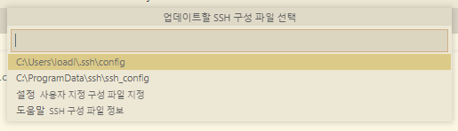

## 모두의 마피아 포팅 메뉴얼

### 사용 기술스택

OS

- windows 10, ubuntu 20.04LTS

backend

- spring boot 2.7.2, gradle, java 11
- jpa/querydsl, mysql, jdbc
- spring security, lombok, swagger3.0.0
- openvidu, oauth2

server

- docker, nginx

frontend

- 

### Backend 빌드 및 배포 메뉴얼

**VS Code AWS SSH 접속하기**

- visual studio code 최신버전 설치 [Download Link](https://code.visualstudio.com/download)
- 확장 프로그램에서 remote ssh 설치
  

- 원격 탐색기 → + 버튼으로 새로운 연결 추

  

  

  

- 

- 

AWS 빌드 환경설정

ufw

openjdk 11

docker

nginx

certbot

openvidu

node js 설치

### Frontend 빌드 메뉴얼

카카오 Oauth 설정

